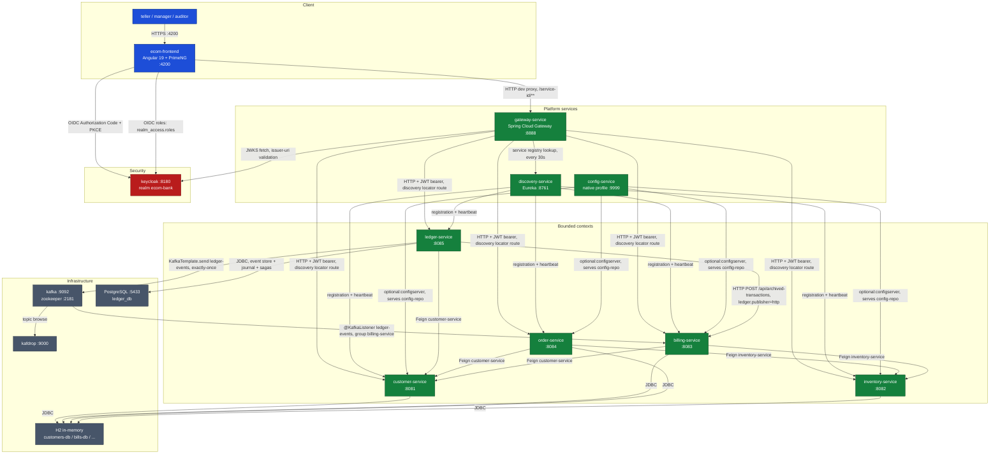
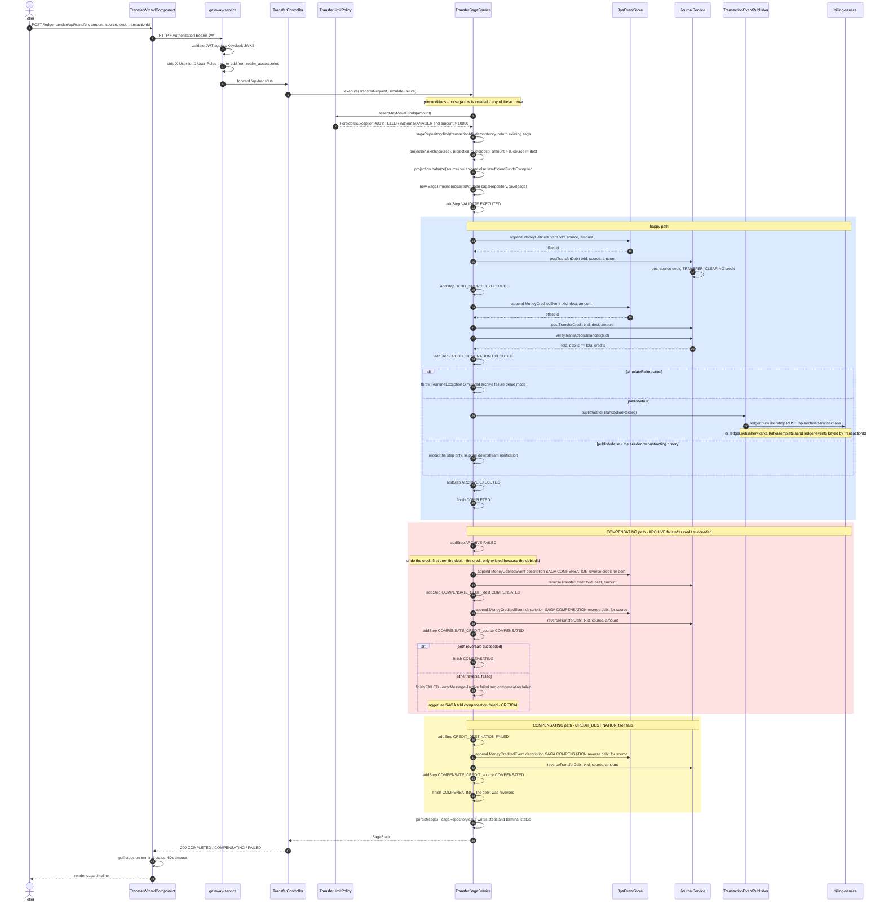
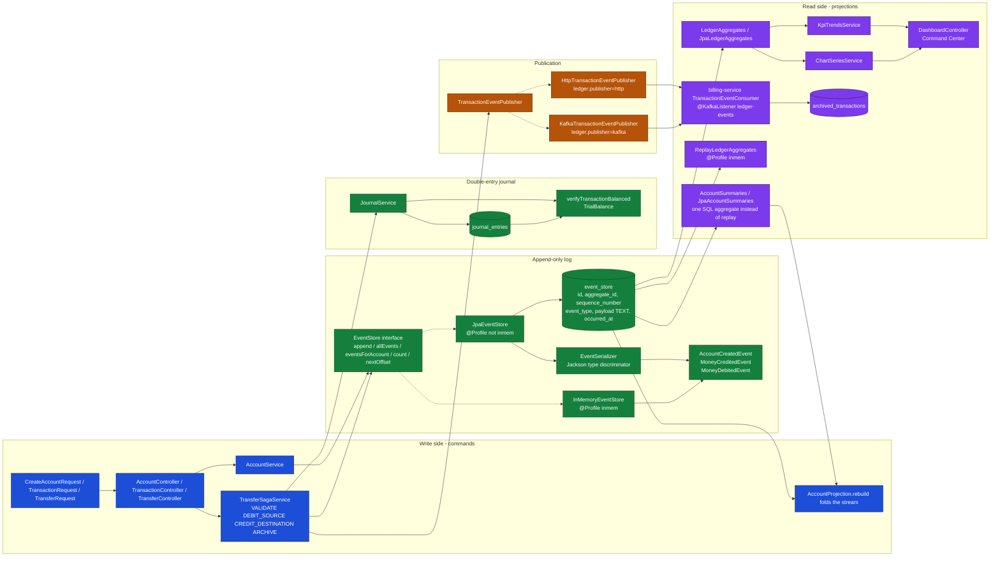
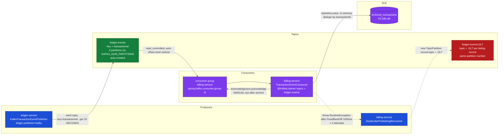
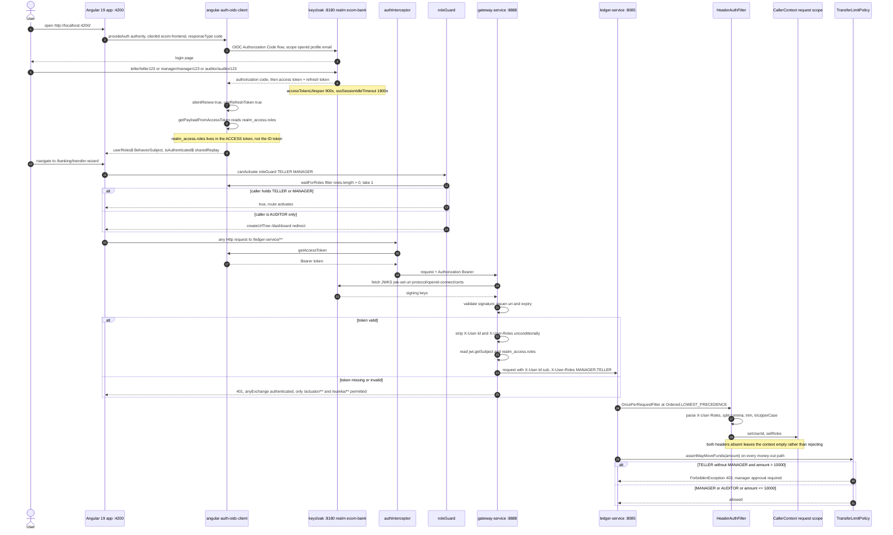
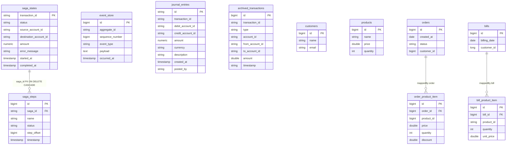

# E-Com Bank — Architecture

> Generated from source at commit `7381cb4` (HEAD, working tree clean).
> Every node, port, topic and field name below is taken from the repository. Anything
> that could not be verified in source is marked **NOT FOUND** rather than guessed.

---

## 1. Executive Summary

- **What it is.** E-Com Bank is a banking-grade platform: an **Angular 19** front end (PrimeNG "Aura" theme) over **8 Spring Boot services** — `gateway-service`, `discovery-service`, `config-service`, `customer-service`, `inventory-service`, `billing-service`, `order-service`, `ledger-service` — where `ledger-service` is the real subject: an **event-sourced, CQRS double-entry ledger** with a **transfer saga** and a "Command Center" BI dashboard.

- **Architectural style.** Service-per-bounded-context behind a single API gateway, with two *different* consistency models deliberately mixed: the e-commerce side (`customer`/`inventory`/`order`/`billing`) is ordinary CRUD on H2 + Spring Data REST, while the money side (`ledger-service`) is **event sourcing + CQRS + orchestrated saga** on Postgres with Kafka fan-out to `billing-service`.

- **Key guarantees.** All-or-nothing money movement via compensating events (`SagaStatus.COMPLETED | COMPENSATING | FAILED`); **double-entry bookkeeping** where every posting debits one account and credits another and `verifyTransactionBalanced(transactionId)` asserts total debits == total credits; an append-only `event_store` with `UNIQUE (aggregate_id, sequence_number)`; and an **anti-spoofing identity boundary** — the gateway strips client-supplied `X-User-Id`/`X-User-Roles` before injecting its own from the validated JWT, and fails closed when no principal resolves.

- **Scale.** A portfolio seed mode writes **500 customers / ~1,100 accounts / 40,000 transactions over 24 months**; the KPI/dashboard path was reworked from event replay to SQL aggregates after the seeded ledger made replay the bottleneck (`perf(accounts)`: 10.8s → 200ms; 1,115 queries and ~102,000 JSON decodes per account-list request before).

- **Notable complexity.** Three-layer role enforcement (Angular `roleGuard` → gateway JWT → request-scoped `CallerContext` + `TransferLimitPolicy`); a **$10,000 TELLER transfer limit enforced on every money-out path**, not just the saga; a `TransactionEventPublisher` strategy that swaps HTTP archival for an **idempotent Kafka producer** on one property; graceful-shutdown + port-clearing restart tooling because an orphaned JVM holding 8085 was a recurring failure; and a `SlaMetricsService` built specifically because a Micrometer counter is cumulative-since-JVM-start and cannot answer "the last 24 hours".

---

## 2. System Topology

- **Routing is implicit, not configured.** `gateway-service` contains **no** `RouteLocator`/`routes` bean and no `spring.cloud.gateway.routes` block (**explicit route config: NOT FOUND**). Routing comes entirely from the discovery locator: `spring.cloud.gateway.discovery.locator.lower-case-service-id=true` plus Eureka, so `/{service-id}/**` is forwarded to the matching instance with the prefix stripped. The front end depends on that contract — `proxy.conf.json` maps `/customer-service`, `/inventory-service`, `/billing-service`, `/order-service`, `/ledger-service` all to `http://localhost:8888` with **no** `pathRewrite`.

- **Two persistence tiers.** Only `ledger-service` has a real database: Postgres `jdbc:postgresql://localhost:5433/ledger_db` with `ddl-auto=validate` and Flyway migrations `V1__create_event_store.sql`, `V2__create_journal_and_saga_tables.sql`, `V3__add_seed_indexes.sql`. The other four services run **H2 in-memory** via `config-repo` (`jdbc:h2:mem:customers-db`, `jdbc:h2:mem:bills-db`, `DB_CLOSE_DELAY=-1;DB_CLOSE_ON_EXIT=FALSE`, `maximum-pool-size=20` for pool-churn resilience). **Postgres is not defined in `docker-compose.yml` — NOT FOUND there**; the datasource URL is the only evidence, overridable via `LEDGER_DB_URL`.

- **`config-service` is not a universal dependency.** It serves `file:./config-repo` with the `native` profile on `:9999`, and `customer`, `inventory`, `billing` and `order` import it as `optional:configserver:http://localhost:9999`. **`ledger-service` has no config client at all** — its configuration lives entirely in its own `application.properties`, which is why `gateway-service` also sets `spring.cloud.config.enabled=false`. Because the import is `optional:`, a down config server degrades to local defaults rather than failing startup.

- **Dev-only caveat, recorded in the README.** Services on 8081–8085 are directly reachable in local development, so a local caller can bypass the gateway and forge `X-User-Roles`. The mitigation is deployment topology (private network, gateway as the only exposed edge), not code.

---

## 3. Transfer Saga Sequence

- **The four canonical steps are literal strings.** `TransferSagaService` calls `saga.addStep("VALIDATE", …)`, `"DEBIT_SOURCE"`, `"CREDIT_DESTINATION"`, `"ARCHIVE"` with status `EXECUTED`, and records `FAILED` on the step that broke. Compensation steps are **dynamic** — `"COMPENSATE_CREDIT_" + accountId` (a `MoneyCreditedEvent` reversing a debit) and `"COMPENSATE_DEBIT_" + accountId` (a `MoneyDebitedEvent` reversing a credit) — and are recorded as `COMPENSATED`.

- **Compensation is ordered, and the order is deliberate.** On an ARCHIVE failure the service reverses the **credit first, then the debit**, because the credit only existed because the debit did; unwinding it first leaves the source-restoring step last. Both reversals run **even if the first fails**, so a half-unwound transfer is recorded as `FAILED` with `errorMessage` rather than silently left mid-flight.

- **Everything before `VALIDATE` leaves no trace.** The role check and all five validation rules run *before* `sagaRepository.save`, so a rejected transfer creates **no saga row, no event and no journal entry** — and the same `TransferLimitPolicy` guards the direct posting paths (`POST /api/transactions` with `type=TRANSFER|DEBIT`), because a limit enforced on one door is not a limit.

- **Idempotency is the saga's own store.** A repeat `transactionId` returns the existing `SagaState` unchanged; `SagaStatus` has exactly three values — `COMPLETED`, `COMPENSATING`, `FAILED` — and `SagaStateEntity` keeps `started_at`/`completed_at` plus `error_message VARCHAR(1000)`, with steps loaded `FetchType.LAZY` (eager fetching pulled 11,334 extra rows to render 2,765 summaries).

---

## 4. Event Sourcing + CQRS

- **There is no account table and no mutable balance.** `AccountProjection` derives balance, holder and history by folding the stream (`AccountCreatedEvent` sets `customerId`/`holderName`, `MoneyCreditedEvent` adds, `MoneyDebitedEvent` subtracts); `AccountState` is the fold result plus the events themselves.

- **Two log positions, on purpose.** The surrogate `id BIGSERIAL` is the **global** position in the log — `JpaEventStore.allEvents()` sorts by it and it is handed back via `Event.setOffset` — while `sequence_number` is the position **within one aggregate**, guarded by `UNIQUE (aggregate_id, sequence_number)`; `append` tracks the next sequence per aggregate in a `HashMap` so a batch of two events for the same account cannot collide.

- **Replay is the correctness path, aggregation is the performance path.** Replay is fine per account (`statement`, `history`, `balance`, and the saga's funds check all use it) but not for the whole ledger: `allAccounts()` was 1,115 queries and ~102,000 JSON decodes per request at portfolio scale. `AccountProjection` therefore delegates to `AccountSummaries` when present — `@Autowired(required = false)`, with replay kept as the `inmem` fallback — and `JpaLedgerAggregates` / `ChartSeriesService` / `KpiTrendsService` answer the dashboard from SQL.

- **The read model that crosses a service boundary is `billing-service`.** `TransactionEventConsumer` consumes `ledger-events` and appends an immutable `ArchivedTransaction` (`transactionId`, `type`, `accountId`, `fromAccountId`, `toAccountId`, `amount`, `timestamp`), deduplicating redeliveries by an in-memory `ConcurrentHashMap` id set — swap for Redis in production, per its own javadoc.

---

## 5. Kafka Topic Topology

| Topic | Producer | Consumer group | Purpose |

|---|---|---|---|
| `ledger-events` | `ledger-service` — `KafkaTransactionEventPublisher`, active only when `ledger.publisher=kafka` | `billing-service` (`spring.kafka.consumer.group-id=billing-service`) | Carry each committed `TransactionRecord` from the ledger to `billing-service`, which archives it into `archived_transactions`. Keyed by `transactionId` so all records for one transaction land on one partition and keep their order. |

| `ledger-events.DLT` | `billing-service` — `DeadLetterPublishingRecoverer` | none (no `@KafkaListener` for it — **DLT consumer: NOT FOUND**) | Dead-letter parking for records that still fail after retries. Destination is computed per record as `record.topic() + ".DLT"` on the **same partition number**. |

- **Retry policy is `FixedBackOff(1000L, 3L)`** — three attempts, one second apart, wired as the container factory's `commonErrorHandler`; only after that does the recoverer publish to the DLT. The listener's own `catch` rethrows a `RuntimeException` specifically so the handler sees a failure instead of the record being acked.

- **Delivery is manual-ack and read-committed.** `ENABLE_AUTO_COMMIT_CONFIG=false` with `AckMode.MANUAL`, and `ISOLATION_LEVEL_CONFIG=read_committed` so the consumer only sees committed (transactional) records; `acknowledge()` is called *after* the archive write, and duplicates short-circuit to an immediate ack.

- **The producer is idempotent, with a bounded retry window.** `ACKS_CONFIG=all`, `ENABLE_IDEMPOTENCE_CONFIG=true`, `MAX_IN_FLIGHT_REQUESTS_PER_CONNECTION=5`, `RETRIES_CONFIG=Integer.MAX_VALUE`, but `REQUEST_TIMEOUT_MS=8000`, `MAX_BLOCK_MS=10000` and `DELIVERY_TIMEOUT_MS=10000` bound total retry time so a Kafka outage **fails fast for the saga to compensate** on the ARCHIVE step instead of hanging it.

- **HTTP is the default transport, Kafka is the opt-in.** `ledger.publisher` defaults to `http` (`HttpTransactionEventPublisher`, `matchIfMissing = true`) which POSTs the same `TransactionRecord` to `billing-service /api/archived-transactions`; both implementations are `@ConditionalOnProperty` so only one bean exists. `AUTO_CREATE_TOPICS_ENABLE: "true"` on the broker means neither `ledger-events` nor `ledger-events.DLT` needs a `NewTopic` bean — and **no `NewTopic`/`TopicBuilder` declaration exists in the repository (NOT FOUND)**.

- **Keying buys ordering and costs parallelism.** Keying by `transactionId` pins every record for one transaction to a single partition, which is what preserves their relative order; with `KAFKA_NUM_PARTITIONS: 3` a single broker caps the read side at three concurrent partitions, and `KAFKA_GROUP_INITIAL_REBALANCE_DELAY_MS: 0` shortens the rebalance stall for a single-consumer demo deployment. `ISOLATION_LEVEL_CONFIG=read_committed` means records sit invisible until committed, so the consumer sees either the whole record or nothing.

- **The archive is only as durable as the store under it.** `archived_transactions` lives in `billing-service`'s H2 in-memory `bills-db` (`DB_CLOSE_DELAY=-1`), so the Kafka consumer's at-least-once guarantee and its in-memory dedupe set are both bounded by the JVM — a restart replays from `earliest` against an empty table and re-archives, which is exactly why the producer keys by `transactionId` and the repository save is the idempotency key the javadoc points at Redis to replace.

---

## 6. Authentication & Authorization

- **Three layers, three different jobs.** The **frontend** `roleGuard(['TELLER','MANAGER'])` on `banking/transfer-wizard` is the only role-gated route in `app.routes.ts` — everything else sits behind `authGuard` alone, and `**` redirects to `/dashboard`. The **gateway** validates the JWT signature against the JWKS and performs identity *translation*. The **backend** (`ledger-service`) makes the actual authorization decision with `TransferLimitPolicy.assertMayMoveFunds`, called first thing in `TransferSagaService.execute`.

- **The header rewrite fails closed, and the comments say why.** The filter *always* removes both headers on the way through, then re-adds them only from the authenticated `JwtAuthenticationToken` read out of the reactive `SecurityContext`; the fallback branch is `defaultIfEmpty(stripIdentityHeaders(exchange))`, i.e. strip-and-continue, never *forward-as-is*. Two silent bugs are documented as fixed: resolving the principal with `exchange.getPrincipal()` (empty at that filter position, so forged headers passed through) and mutating a read-only `HttpHeaders` inside `mutate()` (which threw `UnsupportedOperationException`). The rewrite now uses a `ServerHttpRequestDecorator` that replaces the header map.

- **Roles are read from `realm_access`, and comparison is case-hardened.** The gateway joins `realm_access.roles` into a comma-separated `X-User-Roles`; `HeaderAuthFilter` upper-cases every parsed role so a realm reconfigured with different capitalisation cannot silently stop matching. The limit constant is `TELLER_TRANSFER_LIMIT = BigDecimal("10000")`, compared via `BigDecimal.valueOf(amount)` (shortest decimal representation, not binary floating point) and strictly "more than", so exactly 10,000 is allowed.

- **AUDITOR is a read-only, no-money role.** It holds only `AUDITOR`, so the transfer wizard guard rejects it and the teller-limit rule does not apply to it either (the rule triggers on `TELLER && !MANAGER`); `manager` is deliberately `TELLER + MANAGER` so it clears both the guard and the limit. Note the deliberate asymmetry — **`ledger-service` does not depend on `spring-boot-starter-security` at all**: `HeaderAuthFilter` is a plain servlet filter, and an empty context (direct-port call) simply means no role rules apply rather than a 401.

---

## 7. Data Model

- **`ledger-service` owns three tables in `ledger_db` (Postgres, Flyway V1–V3).** `event_store` is append-only with `UNIQUE (aggregate_id, sequence_number)` and indexes on `aggregate_id`, `event_type`, `occurred_at`; `journal_entries` is keyed by an **application-assigned** `VARCHAR(36)` UUID (the entity implements `Persistable` with `@PostLoad`/`@PostPersist` so a non-null id still inserts rather than merging); `saga_states` is keyed by the business `transaction_id` with `saga_steps` cascading on delete. V3 added `idx_event_store_occurred_at`, `idx_journal_entries_created_at`, `idx_saga_states_status_started`, `idx_journal_entries_debit_created` and `idx_journal_entries_credit_created`.

- **Column-level details the diagram leaves out.** `event_store.id` and `saga_steps.id` are `BIGSERIAL`/`IDENTITY` while `event_store.sequence_number` is unique *per aggregate*, not globally; `journal_entries.amount` and `saga_states.amount` are `NUMERIC(19,4)`, `currency` is `VARCHAR(3)` (always `"USD"`), `description` is `VARCHAR(500)` and `error_message` is `VARCHAR(1000)`; `archived_transactions` uses `IDENTITY` with `amount` as a `double` and `timestamp` as an ISO-8601 **string**, not a temporal column; `saga_steps.step_offset` was renamed from `offset` because that is a PostgreSQL reserved word. `orders.product_items` and `bills.product_items` are `@OneToMany` collections that live in the `order_product_item` / `bill_product_item` tables rather than as columns.

- **Aggregates are accounts, and the account table does not exist.** `aggregate_id` is the account id; account identity comes from `AccountCreatedEvent`'s `accountId` / `customerId` / `holderName`. **Balance is not a column anywhere** — it is the fold of `MONEY_CREDITED` minus `MONEY_DEBITED`.

- **The journal has two pseudo-accounts that are not rows in any table.** `JournalService.CASH_ACCOUNT = "CASH_ACCOUNT"` and `TRANSFER_CLEARING = "TRANSFER_CLEARING"` are string constants written into `debit_account_id`/`credit_account_id`: a plain credit is `CASH_ACCOUNT → account`, a plain debit is `account → CASH_ACCOUNT`, and a transfer is two entries routed through `TRANSFER_CLEARING` (`account → CLEARING`, then `CLEARING → account`). Compensation postings swap the direction of the same two accounts (`reverseTransferDebit` = `CLEARING → account`, `reverseTransferCredit` = `account → CLEARING`).

- **`billing-service` owns the only cross-service read model.** `archived_transactions` mirrors the ledger's `TransactionRecord` record one-for-one and is explicitly immutable ("stored as-is; never mutated"), with `timestamp` kept as a `String` so it round-trips regardless of the consumer's date handling.

- **Cross-service references are plain ids, never JPA relations.** `orders.customer_id → customer-service Customer.id`, `orders.order_product_item.product_id → inventory-service Product.id`, `bills.customer_id → customer-service Customer.id`, `bills.bill_product_item.product_id → inventory-service Product.id`, and `ledger` accounts' `AccountCreatedEvent.customerId → customer-service Customer.id`. Each is resolved at request time by a Feign client (`CustomerRestClientService`, `InventoryRestClientService`, `ledger`/`billing` `CustomerRestClient`, `billing` `ProductRestClient`) into a `@Transient` field, which is why `Customer` and `Product` appear as local model classes in `ledger-service`, `order-service` and `billing-service`. The only real foreign key in the whole system is `saga_steps.saga_id → saga_states.transaction_id`.

---

## 8. Engineering Decisions

| Decision | Alternative | Why this choice |

|---|---|---|
| **Orchestrated saga with compensating events** (`TransferSagaService`, steps `VALIDATE → DEBIT_SOURCE → CREDIT_DESTINATION → ARCHIVE`, statuses `COMPLETED`/`COMPENSATING`/`FAILED`) | Two-phase commit / XA across services | The write path spans an event log, a journal and a downstream publisher that is *sometimes Kafka* — no single transaction manager covers all three, and 2PC would hold locks across a broker call. Compensation is expressed in the domain ("reverse the credit, then the debit") and is itself recorded as `COMPENSATE_CREDIT_*`/`COMPENSATE_DEBIT_*` steps, so a failed unwind is auditable rather than invisible. Compensation running even when the first reversal fails is what makes "half-unwound" a recorded state instead of a lost one. |

| **Event sourcing + CQRS** (`event_store`, `AccountProjection`, no balance column) | CRUD rows with a mutable `balance` column | The ledger is the one place where "how did we get here" matters as much as "what is true now": every state is reconstructible from an append-only log, the log is the audit trail (`aggregate_id` + `sequence_number` ordering), and balances cannot drift from their history because there is no second copy to drift from. `UNIQUE (aggregate_id, sequence_number)` gives optimistic concurrency per account, and the surrogate `id` doubles as a global position. The cost is honest and was measured: replay was 10.8s for the account list, so the read side moved to SQL aggregates while replay stayed the correctness path for single accounts. |

| **Kafka as an opt-in transport** (`ledger.publisher=http` default, `kafka` for exactly-once) | Kafka-only from day one | The archive hop is genuinely at-least-once work with a DLT requirement, which is what Kafka is for — but making it mandatory would couple ledger startup and the saga's ARCHIVE step to broker availability. `@ConditionalOnProperty` keeps exactly one publisher bean alive, HTTP preserves a working local path, and the Kafka producer is configured idempotent (`acks=all`, `enable.idempotence`) with `DELIVERY_TIMEOUT_MS=10000` specifically so a broker outage fails the ARCHIVE step fast enough for the saga to compensate instead of blocking it. |

| **Kafka rather than RabbitMQ for the event hop** | RabbitMQ exchanges/queues | The read side needs *ordered, replayable, partitioned* delivery keyed by `transactionId`, partitioned storage, consumer-group offset replay (`auto-offset-reset=earliest`) and a first-class dead-letter story (`DeadLetterPublishingRecoverer` → `ledger-events.DLT`, `FixedBackOff(1000, 3)`). A log keyed by transaction is the natural fit for an event-sourced producer; a queue would discard the ordering and the replay position. |

| **Central gateway JWT validation + trusted identity headers** (`SecurityConfig.headerInjectionFilter` injecting `X-User-Id`/`X-User-Roles`) | Each service validating the JWT itself | One JWKS client, one issuer check and one place where identity is translated; downstream services stay free of `spring-boot-starter-security` (ledger's `HeaderAuthFilter` is a plain servlet filter) and read a request-scoped `CallerContext`. The security property that makes it safe is **strip-then-inject, failing closed** — the headers are removed from every request *before* being re-added from the validated token, so a forged value cannot survive even on the fallback branch. The acknowledged cost is in the README: dev ports must not be publicly reachable, or the headers can be forged by a direct caller. |

| **Keycloak as the identity provider** (realm `ecom-bank`, realm roles `TELLER`/`MANAGER`/`AUDITOR`, public client `ecom-frontend`) | Custom login, password storage and JWT signing | Banking RBAC needs the unglamorous parts done properly: token lifetimes (`accessTokenLifespan 900`, `ssoSessionIdleTimeout 1800`), refresh-token rotation, JWKS key rollover, and a resource-server integration the gateway can consume as `issuer-uri` + `jwk-set-uri`. A hand-rolled issuer would have to reimplement all of that and would still be the weakest link. The realm is declaratively exported (`keycloak/realm-export.json`, `--import-realm`), so the three graded demo users are reproducible — with the documented sharp edge that `restart` does **not** re-import and `--force-recreate` is required. |

| **Angular 19 with PrimeNG** (`provideAuth`, `authGuard`/`roleGuard`, `authInterceptor`, `proxy.conf.json`) | React + a component library | The app is a dense data console — 16 KPI cards, data tables, a transfer wizard, a saga inspector — so it favours a batteries-included framework: first-party routing with composable functional guards (`roleGuard(['TELLER','MANAGER'])` is a one-line route annotation), a first-party HTTP interceptor chain where `authInterceptor` attaches the bearer token without touching call sites, DI-scoped singletons, and PrimeNG's Aura preset which maps directly onto the design brief's token set (`.app-dark` selector for dark mode, tabular-nums data tables, chart components). `angular-auth-oidc-client` supplies the OIDC code flow, silent renew and refresh tokens, and exposes `realm_access.roles` from the **access** token. |

| **Postgres for the ledger, H2 in-memory for the other contexts** | One database engine everywhere | The money side needs a real append-only log with `BIGSERIAL`, `NUMERIC(19,4)`, partial multi-column indexes and Flyway migrations (`ddl-auto=validate` — the schema is owned by migrations, not Hibernate). The e-commerce contexts are CRUD demo surfaces where H2 keeps a clone-and-run setup free of infrastructure, which is also why `docker-compose.yml` ships Kafka + Keycloak but no database container. |

| **Scheduled seed reconstruction instead of an import script** (`SeedRunner`, `@Profile("seed")` + `ledger.seed.enabled`, `SagaTimeline`, `SeedPacing`) | Backfilling rows with raw SQL | The seeder drives the *real* saga so seeded history has the same shape as live history — genuine events, genuine journal entries, genuine saga steps — and `SagaTimeline` gives each reconstructed run realistic inter-step spacing from a single start instant, so a backfilled saga cannot develop a torn timeline. It passes `publish=false` on the ARCHIVE step so two years of backdated activity is never re-announced to `billing-service`. Seed mode `portfolio` writes 500 customers / ~40,000 transactions over 24 months; the flag-plus-profile pairing stops an accidental profile activation from writing to a database nobody meant to seed. |

---

### Appendix — Verification Notes

- **`ARCHITECTURE.md` sources:** `docker-compose.yml`, all 8 `src/main/resources/application.properties`, `gateway-service/.../application.yml`, `config-repo/*.properties`, `keycloak/realm-export.json`, `ecom-frontend/src/app/{app.routes.ts,app.config.ts,proxy.conf.json}`, `ecom-frontend/src/app/services/auth.service.ts`, `ecom-frontend/src/app/interceptors/auth.interceptor.ts`, `ecom-frontend/src/app/guards/role.guard.ts`, `ledger-service/src/main/resources/db/migration/V1–V3`, and the Java sources named in each section above.

- **Explicitly NOT FOUND:** a Postgres (or any database) service in `docker-compose.yml`; explicit `spring.cloud.gateway.routes` / `RouteLocator` configuration in `gateway-service`; a `NewTopic` / `TopicBuilder` topic declaration for `ledger-events` or `ledger-events.DLT`; a `@KafkaListener` consuming the `.DLT` topic.
- **Discrepancy worth knowing:** `ecom-frontend/README-DEV-PROXY.md` describes the dev proxy routing *directly* to ports 8081–8085 with `pathRewrite`, but the committed `ecom-frontend/proxy.conf.json` sends all five prefixes to the gateway on `8888` with no rewrite. The config file is the operative behaviour.
