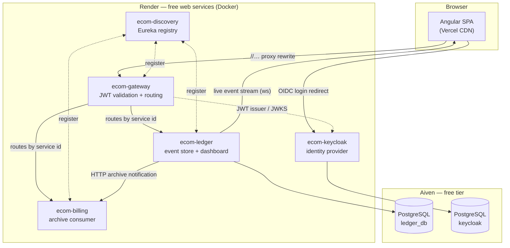

# Deploying ecom-bank on free tiers

A clone-to-live-URL guide for deploying this stack on Render (backend), Vercel
(frontend) and Aiven (two Postgres databases — one for the ledger, one for
Keycloak), at no cost. Everything here is copy-pasteable.

Kafka is **not** part of this deployment; Step 2 explains why and
[Appendix A](#appendix-a--aiven-kafka-runbook-for-the-dlt-milestone) holds the
runbook for when it is. Three of the eight services are deliberately left out.

Read [Known trade-offs](#known-trade-offs) before you start. The free tier is
usable for a demo and not much else.

---

## Architecture of the deployment



Two things about this diagram are load-bearing:

**The browser only ever talks to Vercel and to Keycloak.** API calls stay
root-relative in the bundle (`/ledger-service/api/…`) and Vercel proxies those
prefixes to the gateway, so the browser sees one origin. That is why the
gateway's `globalcors`, which allows only `http://localhost:4200`, does not have
to be widened for the deployment — and why the WebSocket live stream, which is
built from `location.host`, resolves correctly.

**Eureka is the reason the hostnames in this guide must match exactly.** Each
service advertises `$RENDER_EXTERNAL_HOSTNAME` and registers with
`ecom-discovery`; the gateway routes by service id through that registry. A
service that registers with a hostname nobody can resolve is a route that
silently goes nowhere.

---

## Prerequisites

| Account | Used for | Free tier notes |
|---|---|---|
| [Aiven](https://aiven.io) | ledger Postgres, Keycloak Postgres | One free Postgres per project; Kafka is not used — see [Appendix A](#appendix-a--aiven-kafka-runbook-for-the-dlt-milestone) |
| [Render](https://render.com) | the five backend services | Free web services; 750 instance-hours/month |
| [Vercel](https://vercel.com) | the Angular frontend | Hobby plan |
| GitHub | source of truth for both | This repo, `deploy` branch |

You also need the repo pushed to GitHub with the `deploy` branch present. The
Blueprint reads `render.yaml` and the Dockerfiles from that branch.

---

## Step 1 — Provision Aiven PostgreSQL for the ledger

1. Aiven Console → **Create service** → **PostgreSQL** → plan **Free**.
2. Pick a region near you and create it. Wait for **Running**.
3. Open the service's **Overview** → **Connection information**. Copy:

   | Aiven field | Becomes this env var |
   |---|---|
   | Host | (part of `LEDGER_DB_URL`) |
   | Port | (part of `LEDGER_DB_URL`) |
   | Database name | (part of `LEDGER_DB_URL`) |
   | User | `LEDGER_DB_USER` |
   | Password | `LEDGER_DB_PASSWORD` |
   | CA certificate | not needed — see below |

4. Build `LEDGER_DB_URL`. Aiven shows a `postgres://…` **service URI**; the JDBC
   driver needs the `jdbc:` form, and Aiven refuses a connection that does not
   ask for TLS:

   ```
   jdbc:postgresql://<host>:<port>/<database>?sslmode=require
   ```

   The `?sslmode=require` is not optional. Without it the driver's plaintext
   attempt is rejected before authentication, and it surfaces as a confusing
   `SQL State: 08001` rather than a TLS error.

5. **Do not** create the schema by hand. `ledger-service` runs Flyway on
   startup and applies `V1__create_event_store.sql`,
   `V2__create_journal_and_saga_tables.sql` and `V3__add_seed_indexes.sql`
   itself. The `application-prod.properties` profile sets
   `spring.flyway.connect-retries=10` with a 5s interval so a cold database does
   not fail the boot.

There is no seed data on a freshly migrated ledger — an empty ledger is expected,
and `Known trade-offs` explains why the seeder is not run here.

---

## Step 2 — Aiven Kafka (not used in this deployment)

Skip this step. The producer factories (ledger's `KafkaProducerConfig`, billing's
`KafkaConsumerConfig.producerFactory`) do not read `spring.kafka.*`, so they cannot
authenticate against Aiven's SASL_SSL endpoint. Kafka becomes mandatory again
before the DLT consumer milestone; the operational detail is retained in
[Appendix A](#appendix-a--aiven-kafka-runbook-for-the-dlt-milestone).

---

## Step 3 — Provision a database for Keycloak

Keycloak needs its own Postgres. This guide uses **Aiven** rather than Render's
free Postgres: Render's free database expires after 30 days, and the identity
provider losing its realm on day 30 is a worse failure than an extra setup step.
A second free Aiven PostgreSQL service is fine.

1. Create a second free **PostgreSQL** service (Aiven allows one free Postgres
   per project — either create a second project, or reuse the same service with a
   different database).
2. Copy Host, Port, Database, User and Password.
3. Build `KC_DB_URL` in JDBC form, same transformation as Step 1:

   ```
   jdbc:postgresql://<host>:<port>/<database>?sslmode=require
   ```

   `KC_DB_USERNAME` and `KC_DB_PASSWORD` take the Aiven user and password. The
   `KC_DB=postgres` selection is already baked into
   `keycloak-deploy/Dockerfile` as a build-time option — do not add it as a
   dashboard variable, because `--optimized` refuses build-time options supplied
   at runtime.

---

## Step 4 — Deploy the backend on Render

1. Render Dashboard → **New** → **Blueprint**.
2. Connect the GitHub repo and select the **`deploy`** branch. Render reads
   `render.yaml` and shows five services.
3. Fill in every secret below. These are the only values Render asks for; the
   `value:` entries in `render.yaml` are already set.

   | Service | Variable | Where it comes from |
   |---|---|---|
   | `ecom-keycloak` | `KC_DB_URL` | Step 3 |
   | `ecom-keycloak` | `KC_DB_USERNAME` | Step 3 |
   | `ecom-keycloak` | `KC_DB_PASSWORD` | Step 3 |
   | `ecom-ledger` | `LEDGER_DB_URL` | Step 1 |
   | `ecom-ledger` | `LEDGER_DB_USER` | Step 1 |
   | `ecom-ledger` | `LEDGER_DB_PASSWORD` | Step 1 |

   That is the whole list. There are no Kafka variables to fill in — see
   [Appendix A](#appendix-a--aiven-kafka-runbook-for-the-dlt-milestone).

4. **Check the hostnames before you apply.** `render.yaml` hardcodes
   `https://ecom-discovery.onrender.com`,
   `https://ecom-gateway.onrender.com` and
   `https://ecom-keycloak.onrender.com`. Render appends a suffix when a name is
   already taken (`ecom-gateway-a1b2`).

   **This is a sharp edge.** If any of the three is suffixed, these files must
   change together:

   | File | What changes |
   |---|---|
   | `render.yaml` | every `EUREKA_DEFAULT_ZONE` value (four services), plus `KC_HOSTNAME` and `KEYCLOAK_ISSUER_URI` |
   | `gateway-service/src/main/resources/application-prod.properties` | the issuer URI |
   | `ecom-frontend/src/environments/environment.prod.ts` | `keycloakUrl` |

   Then redeploy the frontend, because `keycloakUrl` is compiled into the bundle
   at build time rather than read at runtime.

   `ledger-service` is deliberately not on that list: it does not validate JWTs
   itself, it trusts the `X-User-Id` / `X-User-Roles` headers the gateway derives
   from a validated token (`HeaderAuthFilter`). The gateway is the only party that
   checks the issuer.

   `KC_HOSTNAME`, `KEYCLOAK_ISSUER_URI` and the frontend's `keycloakUrl` must all
   name the same realm URL, byte for byte. The gateway validates the token's
   issuer against its own value, so any difference produces a signature/issuer
   rejection with no useful message at the frontend.

5. **Deploy in this order: `ecom-keycloak` first**, wait for `/admin` to render
   in a browser, **then `ecom-discovery`, then `ecom-ledger`, then
   `ecom-gateway`.** The gateway validates the Keycloak issuer eagerly at
   startup; if Keycloak is still cold, the gateway exits. If that happens, open
   the gateway service in Render and click **Restart** once. This is a free-tier
   cold-start artifact, not a configuration error.

   The Blueprint creates all five services at once, so the practical sequence is:
   apply it, let `ecom-keycloak` finish, check `/admin` renders, then restart the
   others from the dashboard in that order. First deploys also take several
   minutes each: every image builds the whole Maven reactor.

6. Verify:

   ```bash
   curl -s https://ecom-discovery.onrender.com/eureka/apps -H "Accept: application/json" | head -40
   curl -s https://ecom-ledger.onrender.com/actuator/health
   curl -s https://ecom-gateway.onrender.com/actuator/health
   curl -s https://ecom-keycloak.onrender.com/health/ready
   ```

   Expect `"status":"UP"` on the three actuator endpoints and Keycloak's
   `{"status": "UP", …}` on the fourth. The first call to any free service after
   idle takes 30–50 seconds while the container starts — that is the platform,
   not a misconfiguration.

---

## Step 5 — Deploy the frontend on Vercel

1. Vercel → **Add New** → **Project** → import the same GitHub repo.
2. Set **Root Directory** to `ecom-frontend`. Vercel then reads
   `ecom-frontend/vercel.json`, which supplies the rest:

   | Setting | Value |
   |---|---|
   | Framework preset | Angular |
   | Build command | `npx ng build --configuration production` |
   | Output directory | `dist/ecom-frontend/browser` |

   The build command is `npx ng build …` and not `npm run build -- --configuration
   production`. The latter looks equivalent but is not: `package.json`'s `build`
   script is a bare `ng build`, so the extra `--configuration production` lands
   as a positional argument and the CLI reads `production` as a *project name*,
   failing with `Argument: project, Given: "production", Choices: "ecom-frontend"`.

3. Deploy. Vercel installs dependencies and builds; `dist/ecom-frontend/browser`
   is published.

4. Nothing in the bundle points at `localhost` for API calls, but the Keycloak
   URL is compiled in. If you already changed the hostname in Step 4.4, commit
   that change before deploying so the build picks it up.

---

## Step 6 — Point Keycloak at the Vercel domain

> **You must do this or login will fail.**

`keycloak-deploy/realm-export.json` ships with
`https://REPLACE_WITH_VERCEL_DOMAIN/*` in the `ecom-frontend` client's
`redirectUris`, and the matching origin in `webOrigins`. The real domain does not
exist until after the first Vercel deploy, so it cannot be filled in ahead of
time. Until you do this, the login redirect is rejected with
`Invalid parameter: redirect_uri` — and that is the *only* symptom you get, so a
silent failure here is easy to misread as a Keycloak or gateway problem.

Do **one** of the two options.

| | Option A — admin console | Option B — edit the export |
|---|---|---|
| **Use when** | always works, including on an existing realm | the realm is not in the database yet, or you want it reproducible |
| **Steps** | 1. Open `https://ecom-keycloak.onrender.com` and sign in as the Keycloak admin.<br>2. Realm **ecom-bank** → **Clients** → **ecom-frontend**.<br>3. **Valid redirect URIs** → add `https://<your-vercel-domain>/*`.<br>4. **Valid post logout redirect URIs** → add `https://<your-vercel-domain>`.<br>5. **Web origins** → add `https://<your-vercel-domain>`.<br>6. **Save.** | 1. In `keycloak-deploy/realm-export.json`, replace both occurrences of `REPLACE_WITH_VERCEL_DOMAIN` with the real domain. Keep the `http://localhost:4200/*` entries — they are what local development uses.<br>2. Commit and push to `deploy`.<br>3. Render rebuilds `ecom-keycloak`, then **force-recreate** the service so the realm is actually re-imported: the import uses the default `IGNORE_EXISTING` strategy, so on a realm that already exists in the database it is **skipped** and your edit silently does nothing. |
| **Survives a Keycloak rebuild?** | No — console edits live only in the database | Yes — the export is the source of truth |

Either way, finish by confirming the redirect works: open the Vercel URL, and you
should be sent to Keycloak's login page rather than to an error page.

---

## Step 7 — Verification checklist

Run these in order. Each one isolates a layer, so a failure tells you where to
look.

```bash
# 1. Registry is up and advertising hostnames, not 172.x container IPs.
curl -s https://ecom-discovery.onrender.com/eureka/apps -H "Accept: application/json" \
  | grep -o '"hostName":"[^"]*"' | sort -u

# 2. Services are healthy.
for s in discovery ledger gateway billing; do
  echo -n "$s: "; curl -s "https://ecom-$s.onrender.com/actuator/health"; echo
done
curl -s https://ecom-keycloak.onrender.com/health/ready; echo

# 3. Keycloak issues a token for the seeded teller (this is a direct grant,
#    which the realm enables).
curl -s -X POST https://ecom-keycloak.onrender.com/realms/ecom-bank/protocol/openid-connect/token \
  -d "client_id=ecom-frontend" -d "username=teller" -d "password=teller123" \
  -d "grant_type=password" | head -c 200; echo

# 4. The gateway rejects an unauthenticated call (expect 401).
curl -s -o /dev/null -w "%{http_code}\n" https://ecom-gateway.onrender.com/ledger-service/api/accounts

# 5. The gateway routes a real call through the registry.
TOKEN=$(curl -s -X POST https://ecom-keycloak.onrender.com/realms/ecom-bank/protocol/openid-connect/token \
  -d "client_id=ecom-frontend" -d "username=teller" -d "password=teller123" \
  -d "grant_type=password" | sed -n 's/.*"access_token":"\([^"]*\)".*/\1/p')
curl -s -H "Authorization: Bearer $TOKEN" \
  https://ecom-gateway.onrender.com/ledger-service/api/accounts

# 6. The ledger balances. On an empty database every figure is zero, and a
#    trial balance of zeros is still a balanced one.
curl -s -H "Authorization: Bearer $TOKEN" \
  https://ecom-gateway.onrender.com/ledger-service/api/journal/trial-balance
```

Then the browser smoke test:

1. Open the Vercel URL. You are redirected to Keycloak.
2. Log in as `teller` / `teller123`.
3. You land back on `/callback` and the dashboard renders.
4. Confirm the ledger balances: the Trial Balance / dashboard cards should show a
   balanced ledger (debits equal credits). On an empty database every figure is
   zero and that is still balanced — zeros are the expected result before any
   transactions exist.
5. Create an account and run a transfer of $500 between two accounts.
6. Confirm the balances moved by exactly $500 and the trial balance is still
   balanced.

Seeded accounts for the smoke test:

| User | Password | Realm roles |
|---|---|---|
| `teller` | `teller123` | TELLER |
| `manager` | `manager123` | TELLER, MANAGER |
| `auditor` | `auditor123` | AUDITOR |

---

## Known trade-offs

**Cold starts.** A free Render service spins down after 15 minutes idle and takes
30–50 seconds to answer the next request. The first page load after a quiet
period will look broken; it is not. The gateway is the worst case, because it
validates the JWT issuer at startup and will exit if Keycloak is still cold —
if the gateway is down while Keycloak is up, restart the gateway from the
dashboard.

**The ledger starts empty, and the seeder is not run here.** `ledger.seed.enabled`
defaults to `false` and needs the `seed` profile as well, so the deployed ledger
has the schema and no data. That is deliberate: the portfolio mode writes ~40,000
transactions and would take a long time against a free-tier database. To seed
once, run the service locally against the Aiven URL with
`--spring.profiles.active=seed --ledger.seed.enabled=true`.

**The e-commerce services are not deployed.** `customer-service`,
`inventory-service` and `order-service` keep their data in H2 in-memory
databases, and the free plan spins services down after 15 minutes idle. A service
whose entire dataset is in memory comes back empty, so a deployed
`customer-service` would return no customers after every sleep. Because
`ledger-service` looks customers up by id, that also breaks transfers for any
account referencing them. Deploying them needs a real datastore first.

**Archived transactions do not survive a restart.** `billing-service` keeps its
archive in an H2 in-memory database. After a spin-down the Archived Transactions
page is empty until new events arrive. It is fed by the saga's HTTP notification
to the ledger's `TransactionProcessor` endpoint — not by Kafka — which is what
`LEDGER_PUBLISHER=http` selects.

**Kafka is not deployed.** See
[Step 2](#step-2--aiven-kafka-not-used-in-this-deployment): neither producer
factory reads `spring.kafka.*`, so a broker cannot be reached from this stack
without a code change. Kafka is required before the DLT consumer milestone, and
[Appendix A](#appendix-a--aiven-kafka-runbook-for-the-dlt-milestone) is the
runbook for it.

**The live event stream is off.** `ledger.live-stream.enabled` defaults to
`false`, so `/ws/events` 404s on the deployed ledger and the Command Center's live
feed stays empty. Enabling it also starts a second consumer group against
`ledger-events` — which would need a broker that this deployment does not have,
so the stream stays off until the Kafka milestone.

**Keycloak's `/health` endpoints are public.** They are served on the main port
because Render health-checks a single port, and Keycloak's management port (9000)
is not it. They expose UP/DOWN status and a database-connection check, no realm
data.

**Table of deployed vs not:**

| Service | Deployed | Datastore |
|---|---|---|
| `discovery-service` | yes | none |
| `config-service` | no | none — its `config-repo` is on each image's classpath |
| `gateway-service` | yes | none |
| `keycloak` | yes | Aiven Postgres |
| `ledger-service` | yes | Aiven Postgres |
| `billing-service` | yes | H2 in-memory (ephemeral) |
| `customer-service` | no | H2 in-memory |
| `inventory-service` | no | H2 in-memory |
| `order-service` | no | H2 in-memory |

`config-service` is not deployed because nothing in the deployed set needs it:
the four services that import a config server are the e-commerce ones, and
`gateway-service` sets `spring.cloud.config.enabled=false` outright.

---

## Local development is unchanged

Nothing in this guide is required to keep working locally.

```bash
docker compose up -d                     # zookeeper, kafka, kafdrop, keycloak, postgres
mvn clean install -DskipTests
# then start the services in their documented order
```

`docker compose up -d` now also starts `postgres` on 5433 with the `ledger` /
`ledger` / `ledger_db` credentials that `ledger-service` uses by default, so the
manual `docker run` this repo previously required is gone.

Every port stays on its original value when `PORT` is unset — each service reads
`server.port=${PORT:<original>}`, so the only thing that changes on Render is
which port the process binds.

---

## Appendix A — Aiven Kafka runbook (for the DLT milestone)

Not part of this deployment. This is the operational detail that
[Step 2](#step-2--aiven-kafka-not-used-in-this-deployment) points here instead of
carrying inline, and it is what the DLT consumer milestone will need. Nothing in
this appendix is configured today: there are no `SPRING_KAFKA_*` variables in
`render.yaml` and no `spring.kafka.*` lines in either service's
`application-prod.properties`.

1. Aiven Console → **Create service** → **Kafka** → plan **Free**.
2. Wait for **Running**, then create the topics (Aiven Console → the Kafka
   service → **Topics** → **Create topic**):

   | Topic | Partitions | Why |
   |---|---|---|
   | `ledger-events` | 3 | The event stream. 3 matches the local compose setting (`KAFKA_NUM_PARTITIONS: 3`) so a redeploy does not change ordering behaviour. |
   | `ledger-events.DLT` | 1 | Dead-letter topic. `billing-service` derives this name in code as `record.topic() + ".DLT"` (`KafkaConsumerConfig`), so it must be exactly this. |

3. Copy the SASL credentials from **Overview** → **Connection information** →
   *SASL* / *Access credentials*. You need the **SASL host:port**, the
   **username**, and the **password**.
4. Build `SPRING_KAFKA_SASL_JAAS_CONFIG` as a single line. Note the quoting: the
   whole value is one string, and the username/password are inside it.

   ```
   org.apache.kafka.common.security.scram.ScramLoginModule required username="avnadmin" password="<AIVEN_KAFKA_PASSWORD>";
   ```

5. Set `SPRING_KAFKA_BOOTSTRAP_SERVERS` to the SASL host and port:

   ```
   <SASL_HOST>:<SASL_PORT>
   ```

6. Add this block to the relevant `application-prod.properties`, and the two
   variables above to that service in `render.yaml`. It is **not** there today.
   The empty `ssl.endpoint.identification.algorithm` is deliberate: Aiven's CA is
   not in the JRE trust store, so hostname verification fails against the
   broker's hostname. Blanking it disables that check only — `SASL_SSL` still
   encrypts the connection and SCRAM still authenticates it.

   ```properties
   spring.kafka.bootstrap-servers=${SPRING_KAFKA_BOOTSTRAP_SERVERS}
   spring.kafka.security.protocol=SASL_SSL
   spring.kafka.properties.sasl.mechanism=SCRAM-SHA-256
   spring.kafka.properties.sasl.jaas.config=${SPRING_KAFKA_SASL_JAAS_CONFIG}
   spring.kafka.properties.ssl.endpoint.identification.algorithm=
   ```

   Read that block carefully before trusting it: it reaches **consumers** only.
   `billing-service`'s consumer is built by Spring Boot autoconfiguration and
   does pick it up, but neither producer factory does — so until those are
   extended in the DLT milestone, `ledger-service`'s publisher and the
   dead-letter path cannot use Aiven, and `LEDGER_PUBLISHER` must stay `http`.

   That last point is the reason this milestone exists: the dead-letter producer
   is one of the two factories that ignores `spring.kafka.*`, so a poison record
   cannot be routed to `ledger-events.DLT` until SASL is wired into it directly.
