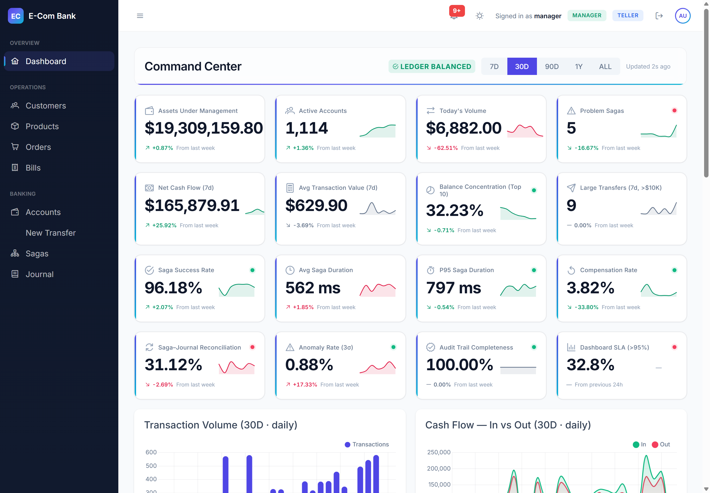
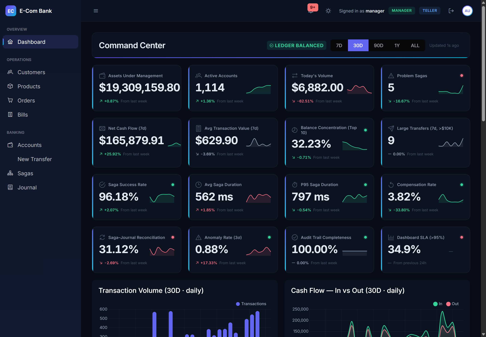
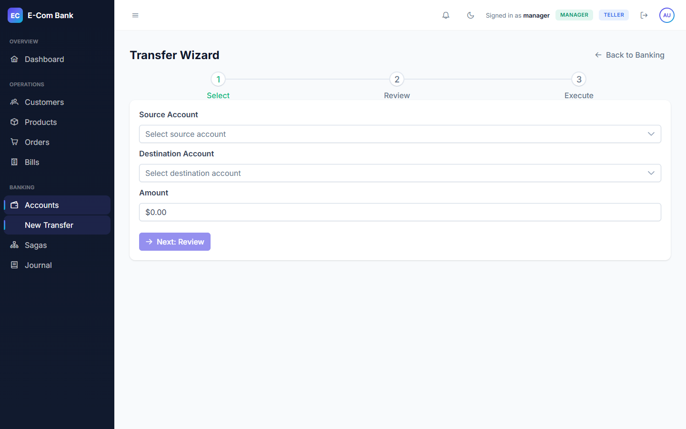
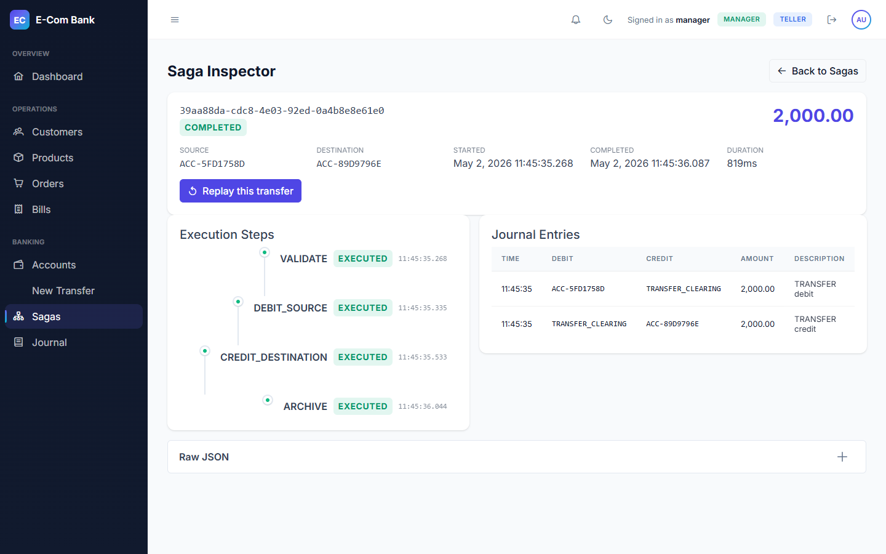
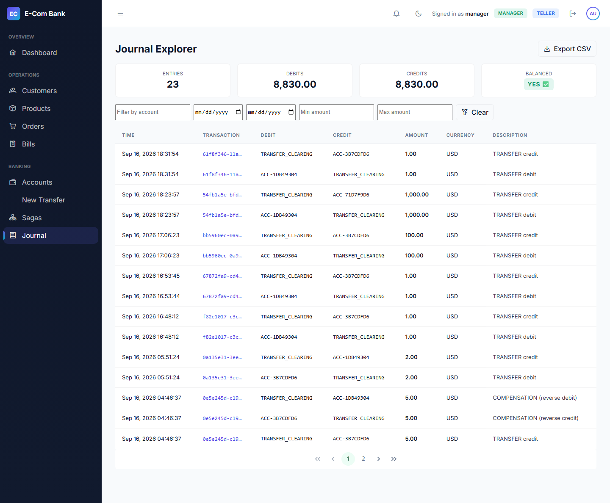
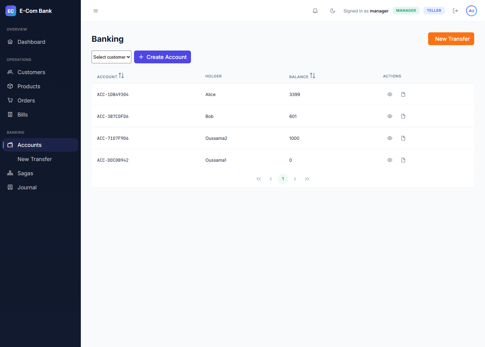
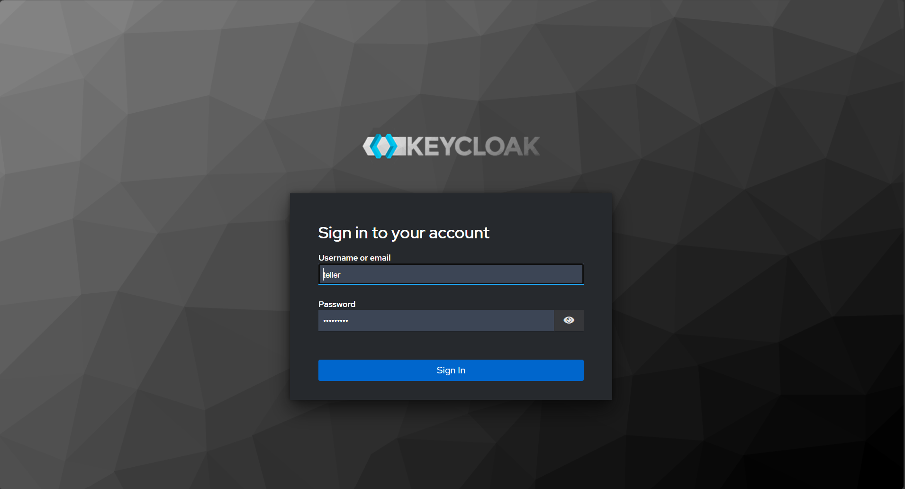
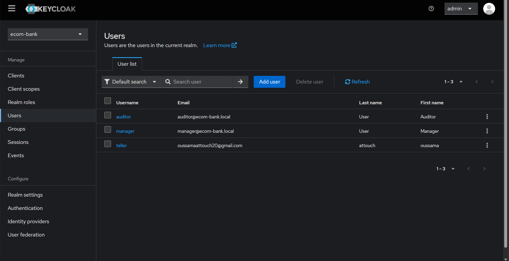

# E-Com Bank

> **Moving money across microservices without distributed transactions — and proving every movement to an auditor.**

[](https://openjdk.org/projects/jdk/21/)
[](https://spring.io/projects/spring-boot)
[](https://angular.dev/)
[](https://kafka.apache.org/)
[](https://www.postgresql.org/)
[](https://www.keycloak.org/)

---

## Table of Contents

| # | Section |
|---|---|
| 1 | [Context](#1-context) |
| 2 | [Problem Statement](#2-problem-statement) |
| 3 | [Solution Overview](#3-solution-overview) |
| 4 | [Screenshots](#4-screenshots) |
| 5 | [Architecture](#5-architecture) |
| 6 | [Key Features](#6-key-features) |
| 7 | [Technical Stack](#7-technical-stack) |
| 8 | [Engineering Decisions](#8-engineering-decisions) |
| 9 | [Results](#9-results) |
| 10 | [Quick Start](#10-quick-start) |
| 11 | [Test Credentials](#11-test-credentials) |
| 12 | [Seed 2 Years of History](#12-seed-2-years-of-history) |
| 13 | [Project Structure](#13-project-structure) |
| 14 | [Documentation](#14-documentation) |
| 15 | [Future Work](#15-future-work) |
| 16 | [Author](#17-author) |

---

## 1. Context

In banking, a money movement is only correct if it satisfies three constraints simultaneously:

- **The ledger must balance** — total debits equal total credits.
- **The audit trail must be complete** — every state change is reconstructable.
- **No partial transfer may ever leave the system in an inconsistent state.**

Traditional monolithic systems solve this with database transactions — a single `BEGIN...COMMIT` guarantees atomicity. Modern banking platforms no longer run as monoliths. They split into independent services — customer management, ledger, notifications, billing — each with its own database, deployment, and failure modes.

**The moment money movement spans two services, distributed transactions become the central engineering problem.**

This project is a deliberate exploration of that problem at portfolio scale: an 8-service banking platform where transfers are atomic in effect, auditable by construction, and enforced under role-based access control.

---

## 2. Problem Statement

### 2.1 The Core Problem

> **How do you move money across microservices without two-phase commit, and prove to an auditor that every movement is correct?**

Three sub-problems fall out of this:

| # | Sub-problem | Why it's hard |
|---|---|---|
| **P1** | No atomic transaction across services | 2PC holds locks across the network — a slow Kafka broker blocks every transfer |
| **P2** | No single source of truth for balance | If two services both store a balance, they will eventually disagree |
| **P3** | No reliable audit trail | "Where did this $500 come from?" must be answerable from the data model, not from logs |

### 2.2 Why Traditional Solutions Fail

| Approach | Why it doesn't work here |
|---|---|
| **Two-phase commit (2PC)** | The transfer spans an event store, a journal table, and a Kafka publisher. No single transaction manager covers all three. 2PC across a broker call blocks every concurrent transfer. |
| **CRUD with a balance column** | A mutable balance has no history. If it drifts from the events that produced it — via a bug, a race, a manual edit — there is no way to detect or repair the drift. |
| **Application-level logging** | Logs are append-only but not queryable. An auditor asking "reconstruct the state on March 1" cannot run that against stdout. |
| **Frontend-only role checks** | A `curl` request bypasses the UI entirely. Authorization that lives only in the browser is not authorization. |

### 2.3 Constraints

| Constraint | Verification |
|---|---|
| Money movement must be atomic in effect | Either both debit and credit happen, or neither does |
| The ledger must balance at all times | Verified on service start and continuously on the dashboard |
| Every transaction must be auditable | State at any past instant is reconstructable from persisted data |
| RBAC must be enforced at the API | A valid TELLER token cannot bypass the $10,000 limit by calling the endpoint directly |

---

## 3. Solution Overview

The platform applies four architectural patterns that together address P1, P2, and P3.

### 3.1 Saga Orchestration — solves P1

A transfer is a **sequence of local transactions**, each with an explicit compensating action:

```
VALIDATE → DEBIT_SOURCE → CREDIT_DESTINATION → ARCHIVE
                              ↓ (on failure)
                          COMPENSATE
```

If any step fails, the orchestrator runs compensations in **reverse dependency order** — reverse the credit first, then the debit — because the credit only existed because the debit did. Each reversal is itself recorded as an audit step (`COMPENSATE_CREDIT_*`, `COMPENSATE_DEBIT_*`).

The saga state is persisted to Postgres between steps. A crash mid-transfer resumes from where it left off rather than restarting.

### 3.2 Event Sourcing + CQRS — solves P2

The ledger stores **events, not state**. Every state change is an immutable append:

```
AccountCreated(account=ACC-1DB49304, holder=Alice)
MoneyCredited(account=ACC-1DB49304, amount=+5000.00)
MoneyDebited (account=ACC-1DB49304, amount=-500.00)
```

Current balance = replay of the stream = **$4,500**. There is **no balance column anywhere** in the schema. Balances cannot drift from their history because there is no second copy to drift from.

Read models (dashboards, KPIs, account lists) are built as **projections** — SQL aggregates against the same event store. Write side is strongly consistent; read side is eventually consistent.

### 3.3 Double-Entry Bookkeeping — solves P3

Every transaction writes **paired journal entries**: one debit, one credit, equal amounts. An invariant checker (`LedgerIntegrityChecker`) refuses to boot the service if `SUM(debits) ≠ SUM(credits)`.

The dashboard displays a real-time `LEDGER BALANCED` indicator. If it ever turns red, that is a P0 alert.

### 3.4 Three-Layer RBAC — enforces business rules

| Layer | Responsibility | Failure mode it prevents |
|---|---|---|
| **Frontend (Angular)** | `roleGuard` blocks routes; hides buttons | Poor UX — user sees actions they can't take |
| **Gateway (Spring Cloud Gateway)** | Validates JWT; strips client-supplied `X-User-Id`/`X-User-Roles`; injects trusted headers | Token forgery, header spoofing |
| **Backend (ledger-service)** | `TransferLimitPolicy` rejects TELLER transfers > $10,000 at the API | A valid token that bypasses the UI |

---

## 4. Screenshots

### 4.1 Command Center — 16 real-time KPIs



16 KPIs with sparklines, trend arrows, and target thresholds. Polled every 5 seconds without a loading flash.

### 4.2 Command Center — Dark Mode



Full parity in dark mode. Design system tokens in `_tokens.scss` define both palettes.

### 4.3 Range-Aware Analytics — 7D / 30D / 90D / 1Y / ALL


Charts and KPIs recompute on range change. Backend aggregates daily data into weekly buckets for 90d, monthly for 1y/all.

### 4.4 Transfer Wizard — Saga Execution Tracker



Three-step wizard: Select → Review → Execute. The Execute step shows the saga's individual step timeline in real time.

### 4.5 Saga Inspector — Step-by-Step Audit



Every saga is inspectable. Each step carries a name, offset, timestamp, and status. Compensations appear as additional steps.

### 4.6 Journal Explorer — Double-Entry Bookkeeping



Every transaction has paired debit/credit entries. The header shows `Total Debits = Total Credits` and a `BALANCED` indicator.

### 4.7 Banking — Accounts with Balances



Account list with replayed balances. The "eye" icon opens a per-account history.

### 4.8 Authentication — OIDC Login Flow



OIDC Authorization Code flow with PKCE. JWT validated at the gateway against Keycloak's JWKS endpoint.

### 4.9 Keycloak — Realm Roles



Three roles — TELLER, MANAGER, AUDITOR — declared declaratively in `realm-export.json`.

---

## 5. Architecture

**📖 Full architecture → [ARCHITECTURE.md](./ARCHITECTURE.md)** — 8 Mermaid diagrams, engineering decisions, and honest gap analysis.

**Highlights:**

| Aspect | Design |
|---|---|
| **Routing** | Discovery-based — no explicit gateway config; Eureka service registry resolves `/{service-id}/**` automatically |
| **Ledger** | Event-sourced — the only service with Postgres; other contexts use in-memory H2 |
| **Kafka** | Opt-in transport — `ledger.publisher=http` by default; switch to `kafka` for exactly-once archival |
| **Security** | Three-layer RBAC — frontend UX → gateway trust boundary → backend authorization |

---

## 6. Key Features

### 6.1 Backend (Java 21 / Spring Boot 3.3)

| Feature | Detail |
|---|---|
| 🎯 **8 microservices** | gateway, discovery, config, customer, inventory, billing, order, ledger |
| 📚 **Event Sourcing + CQRS** | Append-only event store with projections for reads |
| 🔄 **Saga orchestration** | `VALIDATE → DEBIT_SOURCE → CREDIT_DESTINATION → ARCHIVE`, with ordered compensation |
| 📒 **Double-entry bookkeeping** | Paired journal entries; trial balance verified on startup |
| 📨 **Kafka exactly-once semantics** | `acks=all`, `enable.idempotence`, manual ack, DLT for poison messages |
| 🔐 **Keycloak RBAC** | 3 roles enforced across frontend, gateway, and backend |
| 💰 **$10K teller limit** | Enforced at the API, tested with curl |

### 6.2 Frontend (Angular 19 / PrimeNG)

| Feature | Detail |
|---|---|
| 📊 **16 real-time KPIs** | Sparklines, trend arrows, and target thresholds |
| 📈 **Range-aware charts** | 7d / 30d / 90d / 1y / ALL selector recomputes both charts and KPIs |
| 🎨 **Design system** | Dark/light mode, glassmorphic cards, gradient accents, tabular-nums |
| ⚡ **Silent polling** | No loading flash on the 5s refresh cycle; skeletons only on first load |

### 6.3 Analytics (BI)

| Feature | Detail |
|---|---|
| 🔬 **Statistical anomaly detection** | 3σ outlier flagging against a rolling 30-day baseline |
| 🩺 **Pipeline health KPIs** | Projection lag, audit trail completeness, dashboard SLA compliance |
| 📉 **SQL aggregate optimization** | 10.8s → 200ms via event-replay elimination |

---

## 7. Technical Stack

| Layer | Technologies |
|---|---|
| **Backend** | Java 21 · Spring Boot 3.3 · Spring Cloud Gateway · Spring Data JPA · Flyway |
| **Messaging** | Apache Kafka 7.6 · Zookeeper · Kafdrop |
| **Database** | PostgreSQL 16 (ledger) · H2 in-memory (customer / inventory / billing / order) |
| **Security** | Keycloak 26 · OIDC Authorization Code + PKCE · JWT |
| **Frontend** | Angular 19 · PrimeNG 19 · Chart.js · TypeScript 5.6 |
| **Infrastructure** | Docker Compose · Eureka · Spring Cloud Config |
| **Observability** | Spring Actuator · Micrometer · Custom SLA metrics service |

---

## 8. Engineering Decisions

### 8.1 Why saga orchestration instead of 2PC?

The transfer path spans an event log, a journal table, and a Kafka publisher. No single transaction manager covers all three, and 2PC would hold locks across a broker call. Saga compensation is expressible in domain terms — *"reverse the credit, then the debit"* — and each reversal is recorded as an audit step.

### 8.2 Why event sourcing instead of a mutable balance?

A ledger is where "how did we get here" matters as much as "what is true now." Append-only means balances cannot drift from their history. The cost is that queries need projections — accepted because the projection path is fast (SQL aggregates) while the replay path stays the correctness path for single accounts.

### 8.3 Why Kafka over RabbitMQ?

The read side needs ordered, replayable, partitioned delivery keyed by `transactionId`. Kafka gives offset-based replay, first-class DLT support, and idempotent producers. A queue would discard ordering and replay position.

### 8.4 Why three layers of RBAC?

The frontend guard is UX. The gateway is the trust boundary — it strips client-supplied identity headers before injecting trusted ones, and fails closed if no principal resolves. The backend enforces business rules that would otherwise be bypassable by curl. Each layer has a different job; none is redundant.

### 8.5 Why BI metrics on a portfolio project?

Most microservices demos have a dashboard with a handful of KPIs. This one has 16 KPIs including statistical anomaly detection (3σ), projection lag, audit trail completeness, and dashboard SLA compliance. Treating analytics as a first-class system with its own SLIs is the BI discipline the project is designed to demonstrate.

> **More decisions →** [ARCHITECTURE.md §8](./ARCHITECTURE.md#8-engineering-decisions)

---

## 9. Results

### 9.1 Quantified Outcomes

| Metric | Before | After | Change |
|---|---|---|---|
| `/api/accounts` query time | 10.8 s | 200 ms | **54× faster** |
| KPI trends endpoint (7d) | 1.73 s | 679 ms | **2.5× faster** |
| Event-store re-decodes per account-list request | ~102,000 | 0 | Eliminated |
| Total backend tests | — | 238 | All passing |
| Total frontend tests | — | 83 | All passing |
| Seed data (24-month history) | — | 500 customers · 1,100 accounts · 40,000 transactions | — |

### 9.2 Correctness Proofs

| Proof | Evidence |
|---|---|
| **Double-entry invariant** | `SUM(debits) == SUM(credits)` verified on every service start and continuously on the dashboard |
| **Cross-path consistency** | `AUM(now) − AUM(1 year ago) = Net Cash Flow(1 year)` — two independent SQL paths agree to the penny |
| **Compensation correctness** | Killed ledger-service mid-transfer; the ledger still balances after restart |
| **RBAC enforcement** | TELLER `curl` with $15,000 gets HTTP 403; MANAGER gets HTTP 200 |

### 9.3 What's NOT Done (documented, not hidden)

| Gap | Reason |
|---|---|
| Dev proxy bypasses the gateway | Services are reachable directly on ports 8081–8085. Production requires private network topology. |
| DLT topic has no consumer | Poison messages are parked but not processed. |
| H2 databases are in-memory | Customer / inventory / billing / order don't survive restarts (ledger data does). |
| No customer self-service portal | This is an operations platform, not a retail banking app. |

> All documented in [ARCHITECTURE.md — Appendix](./ARCHITECTURE.md#appendix--verification-notes).

---

## 10. Quick Start

### 10.1 Prerequisites

| Requirement | Version |
|---|---|
| Java | 21+ |
| Maven | 3.9+ |
| Node | 20+ |
| Docker Desktop | Latest |

### 10.2 Start Infrastructure

```bash
git clone <repo-url>
cd ecom-app-microservices-main
docker-compose up -d
```

**Starts:**

| Container | Port | Purpose |
|---|---|---|
| Kafka | 9092 | Message broker |
| Zookeeper | 2181 | Kafka coordination |
| Kafdrop | 9000 | Kafka UI |
| Keycloak | 8180 | Identity provider |
| Postgres | 5433 | Ledger database |

### 10.3 Build and Start the 8 Services

```bash
mvn clean install -DskipTests
```

**Start in this order** (IntelliJ recommended):

| # | Service | Port | Notes |
|---|---|---|---|
| 1 | `discovery-service` | 8761 | Must start first |
| 2 | `config-service` | 9999 | Launch from project root |
| 3 | `customer-service` | 8081 | — |
| 4 | `inventory-service` | 8082 | — |
| 5 | `billing-service` | 8083 | — |
| 6 | `order-service` | 8084 | — |
| 7 | `ledger-service` | 8085 | Needs Postgres |
| 8 | `gateway-service` | 8888 | Must start last |

**Or use the restart helper:**

```bash
powershell -File scripts/restart-ledger.ps1
```

### 10.4 Start the Frontend

```bash
cd ecom-frontend
npm install
npm start
```

### 10.5 Open the App

**http://localhost:4200** — sign in with one of the credentials below.

---

## 11. Test Credentials

| Role | Username | Password | Permissions |
|---|---|---|---|
| **TELLER** | `teller` | `teller123` | Transfers up to $10,000 |
| **MANAGER** | `manager` | `manager123` | Unlimited transfers, all features |
| **AUDITOR** | `auditor` | `auditor123` | Read-only, no money movement |

**Keycloak admin console:** http://localhost:8180 (`admin` / `admin`)

---

## 12. Seed 2 Years of History

Populate the ledger with 500 customers, 1,100 accounts, and 40,000 transactions over 24 months:

```bash
java -jar ledger-service/target/ledger-service-0.0.1-SNAPSHOT.jar \
  --spring.profiles.active=seed \
  --ledger.seed.enabled=true \
  --ledger.seed.mode=portfolio
```

**Runtime:** ~7 minutes.

**Note:** The seeder drives the **real saga orchestrator**, so seeded history has the same shape as live transactions — same events, same journal entries, same saga steps, backdated.

---

## 13. Project Structure

```
ecom-app-microservices-main/
├── gateway-service/         # Spring Cloud Gateway + JWT validation
├── discovery-service/       # Eureka server
├── config-service/          # Spring Cloud Config
├── customer-service/        # Customer CRUD (H2)
├── inventory-service/       # Product CRUD (H2)
├── billing-service/         # Bills + Kafka consumer (H2)
├── order-service/           # Orders + Feign clients (H2)
├── ledger-service/          # Event store + journal + sagas (Postgres)
├── ecom-frontend/           # Angular 19 + PrimeNG dashboard
├── keycloak/                # Realm export (TELLER / MANAGER / AUDITOR)
├── config-repo/             # Centralized configs
├── scripts/                 # Restart helpers
├── docs/
│   ├── ARCHITECTURE.md      # 8 Mermaid diagrams + decisions
│   ├── DESIGN-BRIEF.md      # UI design system
│   ├── UI-AUDIT.md          # Bug audit and remediation log
│   └── screenshots/         # All project screenshots
├── docker-compose.yml
└── README.md
```

---

## 14. Documentation

| Document | Purpose |
|---|---|
| [ARCHITECTURE.md](./ARCHITECTURE.md) | System topology, saga sequence, event sourcing, Kafka topology, auth flow, data model, engineering decisions |
| [docs/DESIGN-BRIEF.md](./docs/DESIGN-BRIEF.md) | UI design system — palette, typography, component specs |
| [docs/UI-AUDIT.md](./docs/UI-AUDIT.md) | Bug audit and remediation log |

---

## 15. Future Work

Deliberately out of scope for this iteration:

| Feature | Why it matters |
|---|---|
| **Customer self-service portal** | A `CUSTOMER` role scoped to their own accounts. Requires tenant-scoped authorization across every read endpoint. |
| **DLT consumer** | A `@KafkaListener` on `ledger-events.DLT` that alerts on poison messages. |
| **Persistent H2 → Postgres** | For customer / inventory / billing / order contexts. |
| **mTLS between services** | Currently the gateway is the trust boundary; services trust its headers over the private network. |
| **OpenTelemetry tracing** | Distributed traces across saga steps. |
| **Reconciliation service** | Nightly job that verifies Kafka events against journal entries. |

---


## 16. Author

**Oussama Attouch**

[GitHub](https://github.com/Oussama-Att) · [LinkedIn](https://linkedin.com/in/oussama-attouch)

---

**Built with:** ☕ Java · 🅰️ Angular · 🐘 Postgres · 🔴 Kafka · 🔑 Keycloak
